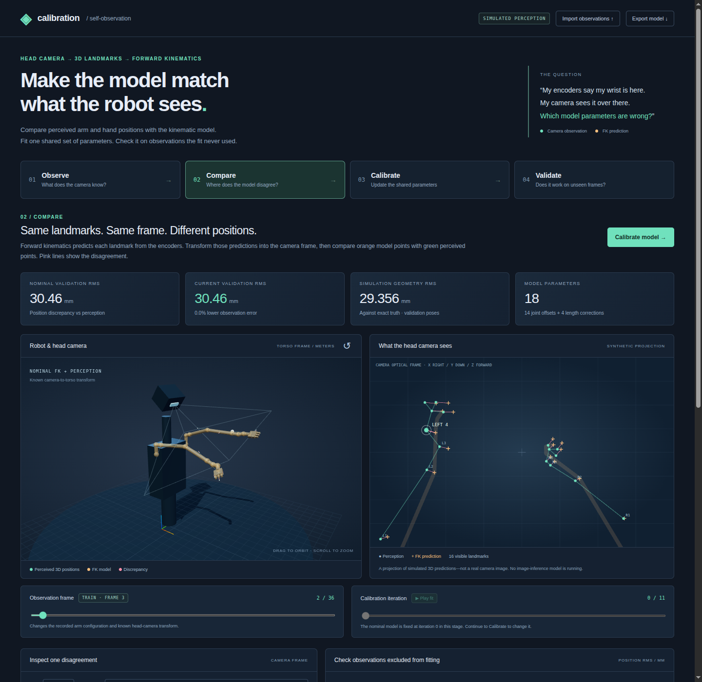

# Head-camera self-calibration

A focused experiment: **use labeled 3D arm and hand positions from a head-mounted camera to calibrate forward kinematics**.

The robot has two descriptions of each landmark: its perceived camera-frame position and the position predicted from joint encoders by the kinematic model. This app makes the discrepancy visible, fits shared parameters, and checks observations excluded from fitting.

The previous collection of mini-projects has been replaced. There is one workflow: **Observe → Compare → Calibrate → Validate**.



## Open directly in your browser

**[Launch the interactive lab](https://kiwooshin.github.io/calibration-lab/)** — no installation or local server.

The example loads immediately from an exported result. Pressing **Calibrate model**,
changing synthetic observations, or importing a JSON dataset runs the actual
Python/SciPy solver in your browser, using a background Web Worker. Imported
observations stay in the browser and are not uploaded to a calibration server.
First use downloads the pinned [Pyodide](https://pyodide.org/en/stable/usage/index.html)
runtime and NumPy/SciPy from jsDelivr; an internet connection is needed. Later fits
reuse the loaded runtime. Use a current browser with WebAssembly and WebGL support.

To export the static site for hosting (maintainers only):

```bash
python build_static.py --output artifacts/site
```

Publish the contents to any static web host. The generated `demo.json` is the
initial example; `python-sources.json` contains the same calibration code used by
the local server. Pyodide 314.0.2 supplies SciPy 1.18.0, including accepted-iteration
callbacks. Opening the HTML via `file://` is not supported; use the hosted link.

## Run on a Mac (optional)

Python 3.11 or newer is required.

```bash
git clone https://github.com/KiwooShin/calibration_lab.git
cd calibration_lab
python3 -m venv .venv
source .venv/bin/activate
python -m pip install -r requirements.txt
python server.py
```

Open **http://localhost:8765**. If you already cloned the repository, use `git pull --ff-only` first. Stop an older server with Ctrl+C before starting the replacement. Use `python server.py --port 8766` if the port is occupied.

The browser assets are bundled; no npm build or external frontend service is needed. The server binds to loopback only. A WebGL-capable browser displays the 3D robot; the camera projection and numerical controls remain usable without WebGL.

To view the server running on `spark-ddbc` from a Mac connected to Tailscale:

```bash
ssh -N -L 8765:127.0.0.1:8765 kiwoos@100.127.140.45
```

Leave that terminal open and visit the same localhost URL. Choose either local execution or the tunnel; they cannot both bind the same local port.

## What the visualization explains

1. **Observe:** green points are the perceived 3D landmarks. Choose an observation to change the recorded arm configuration and known head-camera transform. Missing detections are omitted.
2. **Compare:** orange geometry and crosses are nominal FK predictions. Pink segments connect corresponding predictions and measurements. The residual inspector magnifies one discrepancy in the camera XY plane and separately reports depth error.
3. **Calibrate:** the solver fits a shared model using training observations. Replay actual accepted optimizer iterations. Changing the model iteration leaves the recorded joint readings, perception positions, and camera transforms fixed.
4. **Validate:** only held-out frames are available on the observation slider. Compare iteration 0 with the final iteration. These observations never enter the fitting objective.

The observation-frame and model-iteration sliders are independent. The initial demo is fitted at static export time or when the local server starts; selecting Calibrate from Compare runs the solver again. Directly selecting the Calibrate stage replays the current result.

The camera panel projects 3D positions into an image plane. It is **not a real RGB image**, and this repository does not include a trained perception model. The synthetic source emulates the assumed perception interface. Import your actual 3D predictions after adapting the generic geometry and landmark definitions to your robot.

## Calibration model

- Two generic seven-revolute-joint arms; these are not NEO geometry.
- Unknowns: 14 encoder zero offsets and four upper/forearm link-length corrections.
- Measurements: labeled 3D landmark positions, per-axis uncertainty, synchronized joint readings, and known camera-to-torso transforms for each frame.
- A known moving-head transform is supported. The demo includes gentle head yaw.
- No measured hand orientation enters the fit.
- Residuals compare predicted and observed positions in the camera frame, whitened by their per-axis standard deviations. A soft-L1 loss reduces the influence of outliers.
- Camera calibration, shoulder transforms, and landmark attachments are fixed inputs. The solver does not jointly estimate those quantities.
- Raw parameter sensitivities report local rank and conditioning. Rank deficiency or fitting bounds are shown as diagnostic messages, not silently treated as a successful identification of every parameter.

The generic chain has local joint axes Z, Y, X, Y, X, Y, Z. Its right arm is the reflected physical geometry with a proper palm-frame rotation. Known off-axis upper/forearm features and rigid hand reference points provide positional constraints. Changing these definitions changes what is identifiable.

## Default synthetic result

The seed-52 demo has 48 synchronized frames, split into 36 training and 12 validation frames. It includes 2 mm lateral / 4 mm depth noise before per-point uncertainty scaling, 15% random missing detections, and 4% outliers.

| Metric | Nominal model | Calibrated model |
| --- | ---: | ---: |
| Held-out observation RMS | 30.464 mm | 9.481 mm |
| Held-out observation median | 28.213 mm | 4.792 mm |
| Synthetic geometry RMS at held-out configurations | 29.356 mm | 0.563 mm |

The remaining observation error includes perception noise and outliers. It is different from geometric error against exact synthetic truth. Imported data never displays simulation-only accuracy claims. These numbers are educational simulation results, not hardware benchmarks.

## Import and export

Use **Import observations** to upload the documented JSON dataset and run the same calibration pipeline. Training and validation splits are explicit in the input. The interface has no dependence on hidden synthetic ground truth.

See [the input schema and landmark definitions](docs/observations.md), also summarized in the app's **Input format & model assumptions** link.

```bash
# Write a complete sample input dataset.
python -m calibration --example artifacts/observations.json

# Fit the supplied dataset, with no simulation truth.
python -m calibration --input artifacts/observations.json --output artifacts/fit.json

# Run the reproducible synthetic experiment from the command line.
python -m calibration --output artifacts/demo.json
```

**Export model** downloads fitted joint offsets in radians and link-length corrections in meters, plus validation metrics and diagnostics. Displayed optimizer parameters use degrees and millimeters for readability. The downloadable model is always the completed fit, independent of the playback position.

Generated data and screenshots go in `artifacts/` and are ignored by Git.

## Checks

For the static site, serve an export and run:

```bash
python tests/static_browser_smoke.py --url http://localhost:8000/
# On hosts requiring headed WebGL: xvfb-run -a python tests/static_browser_smoke.py --headed --url http://localhost:8000/
```

This optional Playwright check runs the actual browser solver and compares its
held-out residual to native Python, imports and exports data, exercises invalid
input and regeneration, and checks mobile layout and the absence of API requests.

```bash
PYTEST_DISABLE_PLUGIN_AUTOLOAD=1 python -m pytest -q
```

The environment variable isolates the suite from unrelated globally installed pytest plugins. Tests cover camera transforms/projection, position-only recovery with head motion, strict training/validation separation, robust fitting, imported-data semantics, landmark kinematic dependencies, malformed inputs, and rank-deficient data.

Optional browser checks, with the server running in another terminal:

```bash
python -m pip install playwright
python -m playwright install chromium
python tests/browser_smoke.py
```

This ARM64 Linux host needs a full browser under a virtual display for WebGL:

```bash
xvfb-run -a python tests/browser_smoke.py --headed
```

The browser suite exercises all four stages, both fitting endpoints, fixed observations during optimizer playback, validation-only frame selection, real-data import, model export, settings, WebGL, and mobile overflow. Screenshots are saved in `artifacts/screenshots/`.

## Boundaries

The simulator models field of view and random dropout, not accurate self-occlusion. It does not enforce collision avoidance or simulate actuator dynamics. Hand reference points are rigid, not articulated fingertips. Robust fitting limits isolated outliers but cannot eliminate systematic perception bias. The solver assumes synchronized observations and does not estimate time delay.

For hardware, replace the generic chain and landmark attachments with the robot's nominal model, use independently predicted perception landmarks, and collect suitable training and held-out data. A keypoint that moves along a silhouette with viewpoint is not a fixed physical landmark.

## Files

| Path | Purpose |
| --- | --- |
| `calibration/geometry.py` | Two-arm FK, camera transforms, projection, model export |
| `calibration/dataset.py` | Observation validation and synthetic perception source |
| `calibration/solver.py` | Robust fit and held-out evaluation |
| `calibration/__main__.py` | Dataset generation and calibration CLI |
| `server.py` | Loopback-only server and calibration endpoints |
| `web/` | Single-workflow interface, 3D view, camera overlay, residual plots |
| `tests/` | Numerical and browser checks |
| `plan.md` | Fresh-start scope and completion status |

Three.js 0.180.0 and OrbitControls are vendored under their MIT license in `web/vendor/LICENSE.txt`.
