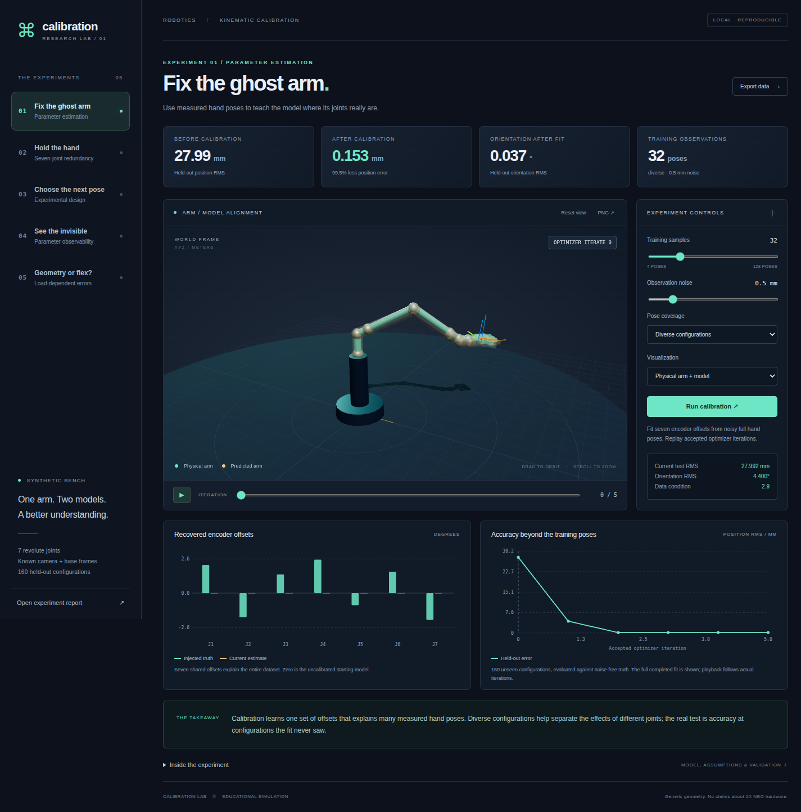

# Seven-DOF Arm Calibration Lab

Five interactive experiments about calibrating forward kinematics from externally measured hand poses. Built as a local numerical research demo with an orbitable 3D arm, actual optimization playback, live calibration controls, and exported evidence.

The arm is generic, not a model of 1X NEO. Measurements are synthetic. Camera intrinsics, extrinsics, the base frame, and the measured palm frame are known, except for the explicitly varied terminal-frame orientation in experiment 4.



## Run

Python 3.11 or later is required. From this directory:

```bash
python -m pip install -r requirements.txt
python run_experiments.py
python server.py
```

Open **http://127.0.0.1:8765**. The server binds to loopback only. Use `python server.py --port 8766` to select another port. If results are missing, the server generates them at startup.

No npm install or frontend build is needed. Three.js 0.180.0 and OrbitControls are vendored locally, with their MIT license in `web/vendor/THREE-LICENSE.txt`. The dashboard makes no external runtime requests. A WebGL-capable browser is required for the 3D scene; numerical plots still work if WebGL is unavailable.

## Explore the five projects

1. **Fix the ghost arm.** Adjust training count, observation noise, and pose coverage, then click **Run calibration**. The local Python endpoint performs a new nonlinear least-squares fit. Replay its accepted iterates, compare injected and estimated offsets, and switch to the held-out workspace error map. Its color scale stays fixed during playback.
2. **Hold the hand.** Play a fixed-full-pose self-motion. Switch between the uncalibrated planner and a newly planned trajectory using fitted offsets. Inspect the magnified XZ drift trace, position drift over time, and equal-budget dataset comparison.
3. **Choose the next pose.** Watch greedy information-based selection from a shared candidate pool. Inspect marginal information scores, selected configurations, and actual held-out error at six measurement budgets. The random baseline includes ten selections and an interquartile band.
4. **See the invisible.** Switch point-only/full-pose measurements and narrow/broad joint excitation. Change the model along its weakest sensitivity direction. Point measurements cannot recover terminal-frame orientation; full pose improves rank, while narrow excitation remains poorly conditioned.
5. **Geometry or flex?** Sweep payload from 0 to 3 kg. Compare a rigid model with a model that includes elbow compliance. Select 1× for physical geometry, or use labeled displacement exaggeration. The plots always report physical errors, including a 2 kg payload excluded from training.

Each module is an independent, seeded experiment. Changing the first module does not silently change the others. **Export data** saves the current module's numerical evidence, including any live ghost-arm refit. **PNG** exports the current 3D view. The report link opens the default five-experiment PDF.

Drag to orbit, scroll to zoom, and use **Reset view** to restore the camera. Animations start only when requested. Sliders can be used with keyboard arrows.

## Default measured results

These are deterministic synthetic results, not hardware benchmarks. Position metrics below are RMS on 160 unseen configurations unless labeled otherwise.

| Experiment | Measured result |
| --- | --- |
| Ghost arm, 32 diverse observations, 0.5 mm positional noise | 27.992 → 0.153 mm; fitted orientation RMS 0.037° |
| Fixed-hand self-motion | Maximum physical hand drift 33.017 → 0.193 mm after replanning with the calibrated model |
| Information selection, 32 observations | 0.201 mm versus random-selection median 0.407 mm |
| Point-only observability, 10 parameters | Rank 7: three terminal-frame orientation directions are invisible |
| Full-pose observability | Rank 10; condition number 17.1 with broad excitation versus 9900.8 with narrow excitation |
| Unseen 2 kg payload | Unloaded rigid model 4.158 mm; mixed-load rigid model 3.965 mm; compliance model 0.096 mm |
| Recovered compliance | 0.0025049 rad/Nm versus injected 0.0025 rad/Nm |

See [all result data](results/data.json), the [PNG report](results/overview.png), the [PDF report](results/overview.pdf), and [browser screenshots](results/screenshots/).

## Model and experimental choices

- The chain has seven revolute joints with local axes Z, Y, X, Y, X, Y, Z. Each rotation is followed by its fixed local link translation. Internal units are meters and radians. The palm pose uses column-vector transforms.
- FK is deterministic for all seven measured joint angles. Redundancy appears when solving for joint motion given a hand pose.
- Calibration residuals combine position differences with the SO(3) logarithm of the relative orientation. Whitened residual scales are 1 mm and 0.15°. Encoder offsets are bounded to ±0.2 rad. The calibration starts at zero offsets.
- Noise is independent Gaussian translation and small rotation-vector noise. A 1 mm control setting corresponds to 0.15° per rotational component. Held-out evaluation uses noise-free synthetic truth to measure model error separately from observation noise.
- The null-space controller uses the geometric motion Jacobian, SVD continuation, and a full-pose correction after each finite step. It stops at a joint limit, near a singularity, or on correction failure. It does not implement collision avoidance.
- Experimental design and observability use the **parameter** Jacobian, which is distinct from the motion Jacobian. Greedy selection uses noise whitening, a 3° parameter prior, and a log-determinant information criterion. Its scores are calculated at the fixed nominal model. Random trials vary selections while sharing the same noisy candidate observations.
- The observability experiment adds three terminal-frame rotations to the seven offsets. It uses a relative rank threshold of 10⁻⁷. Full rank is local and does not guarantee a stable finite-noise estimate. Finite perturbation playback recomputes nonlinear FK, so second-order effects are retained.
- The compliance model is an explicit small-deflection approximation: payload gravity torque is evaluated at the unloaded pose, and only joint 4 deflects by `compliance × torque`. It does not solve elastic equilibrium or model link masses, backlash, hysteresis, transmission, or actuator dynamics. The mixed-load rigid and compliant fits use the same 96 observations; the unloaded rigid fit uses 32.
- The arm and all datasets are educational kinematics. Broad configurations are not filtered for ground contact, self-collision, camera visibility, or real robot reachability constraints. Adapting the lab to hardware requires a real robot model, measurements, and an appropriate motion controller.

## Validation

```bash
PYTEST_DISABLE_PLUGIN_AUTOLOAD=1 python -m pytest -q
```

The environment setting isolates these tests from unrelated installed plugins.
It is needed on this machine because the shell exposes ROS pytest plugins from
a different Python environment; those plugins otherwise fail before collection.

The numerical tests verify rigid transforms, batched FK, the motion Jacobian against finite differences, noise-free encoder recovery, full-pose null-space invariance, positive information accumulation, exact point-only terminal-orientation ambiguity, gravity torque against the potential-energy gradient, and joint offset/compliance recovery.

For browser checks, keep `python server.py` running in another terminal:

```bash
python -m pip install playwright
python -m playwright install chromium
python tests/browser_smoke.py
```

On this ARM64 Linux machine, headless Chromium cannot create WebGL even with SwiftShader. The full Chromium browser under a virtual display works:

```bash
xvfb-run -a python tests/browser_smoke.py --headed
```

The smoke check covers all five modules, a fresh zero-noise fit through the UI/API, timeline and scenario controls, JSON/PNG downloads, WebGL initialization, mobile overflow, and invalid API requests. It saves screenshots under `results/screenshots/`. No JavaScript page errors were observed.

## Files

| File | Purpose |
| --- | --- |
| `model.py` | FK, motion and parameter Jacobians, measurement model, calibration, and payload torque |
| `experiments.py` | Five sequential, seeded experiments |
| `run_experiments.py` | Rebuild saved data and standalone scientific plots |
| `server.py` | Local static server and bounded live-calibration endpoint |
| `web/app.js` | Experiment controls and data-driven visualizations |
| `web/scene.js` | Orbitable Three.js arm, points, frames, and error vectors |
| `web/charts.js` | SVG charts generated from numerical results |
| `tests/` | Numerical checks and optional browser smoke check |

## References

- [Modern Robotics: Jacobians, singularities, and redundancy](https://modernrobotics.northwestern.edu/nu-gm-book-resource/5-3-singularities/)
- [Stepanova et al.: robot calibration with self-observation and complementary constraints](https://arxiv.org/abs/2012.07548)

The project scope and completion record are in [plan.md](plan.md).
